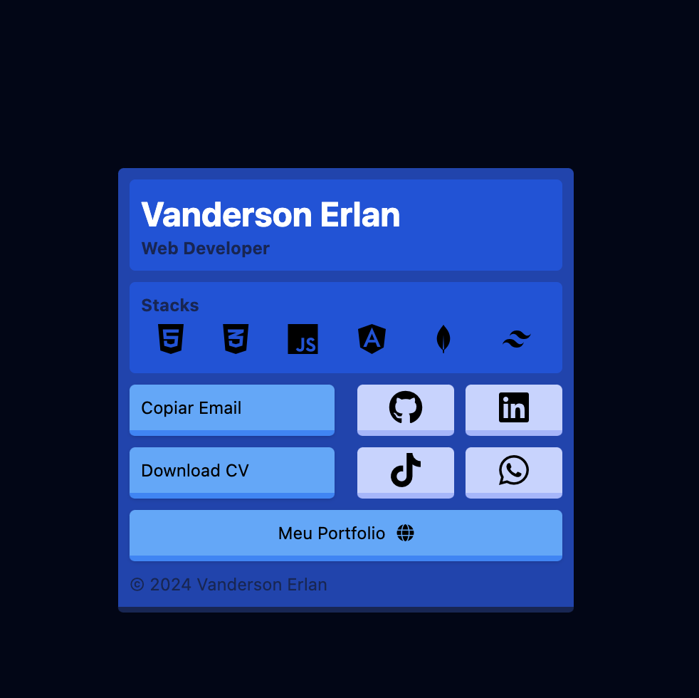

<h1 align="center">Link Bio Tailwind</h1>

    <a href="#layout">Layout</a> • 
    <a href="#howto">Como usar</a> • 
    <a href="#stack">Tecnologias</a>

    <a href="https://vanderson-dev.com/linkbio.html">Projeto em funcionamento</a>

Um projeto para agrupar links de mídias sociais de usuário

<h2 id="layout">🎨 Styles</h2>

    

<h2 id="howto">Como utilizar esse layout? 💻</h2>

    
Para utilizar você tem duas opções:

    
- Baixar o ZIP, extrair e utilizar.

    
- Clonar o repositório e utilizar.

<h2 id="stack">Tecnologias utilizadas 🧑🏾‍💻</h2>

    
HTML 5

    
Tailwind CSS

    
JavaScript

